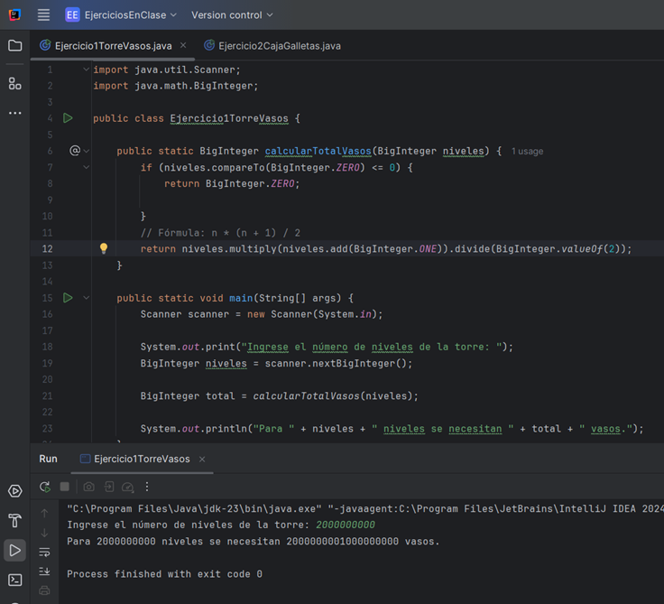

# 

Este repositorio contiene la solución a la Tarea 2 de la asignatura Pruebas de Software II. En esta entrega se desarrollaron dos ejercicios en Java, aplicando análisis de problemas, estructuras de control y buenas prácticas en la programación.

---

<a name="indice"></a>
## 

1. [Ejercicio 1: Torre de vasos](#ejercicio1-torre-de-vasos)
2. [Ejercicio 2: Cajas de galletas](#ejercicio2-cajas-de-galletas)
3. [Requisitos](#requisitos)
4. [Cómo ejecutar](#como-ejecutar)
5. [Conclusión](#conclusion)
6. [Desarrolladora](#desarrolladora)

---

<a name="ejercicio1-torre-de-vasos"></a>
## 

Imagina que en una fiesta se quiere apilar vasos desechables formando una torre. Cada nivel de la torre tiene un vaso menos que el nivel inferior.

### Ejemplo con 4 niveles:
- **Nivel 1:** 4 vasos
- **Nivel 2:** 3 vasos  
- **Nivel 3:** 2 vasos
- **Nivel 4:** 1 vaso
- **Total:** 10 vasos

## 1. Planteamiento del problema
Queremos calcular cuántos vasos en total se necesitan para formar una torre en la que cada nivel tiene un vaso menos que el nivel inferior.

Ejemplo con 4 niveles:
- Nivel 1 → 4 vasos
- Nivel 2 → 3 vasos
- Nivel 3 → 2 vasos
- Nivel 4 → 1 vaso
- Total = 10 vasos

Esto equivale a sumar los primeros 'n' números enteros (serie aritmética):

<div align="center">
  
</div>

## 2. Análisis
- **Entrada:** Un número entero positivo 'niveles'
- **Proceso:** Sumar los vasos de cada nivel desde el nivel 1 hasta el nivel 'niveles'
- **Salida:** Número entero con el total de vasos

## 3. Pseudocódigo
```
funcion calcularTotalVasos(niveles: entero) regresa entero
  total ← 0
  para i desde 1 hasta niveles hacer
    total ← total + i
  fin para
  regresar total
fin funcion
```

## 4. Diagrama de flujo

<div align="center">
  
</div>

Se implementó un método en Java llamado `calcularTotalVasos(int niveles)`, el cual devuelve la cantidad total de vasos necesarios para construir la torre.

<div align="center">
  
</div>

[⬆️ Volver al índice](#indice)

---

<a name="ejercicio2-cajas-de-galletas"></a>
## 

Un negocio de repostería empaca galletas en cajas pequeñas, siguiendo la regla de que cada caja contiene la mitad de galletas que la anterior. El proceso se repite hasta que la cantidad sea menor a 1.

### Ejemplos:
- **galletas = 16** → 16 + 8 + 4 + 2 + 1 = **31**
- **galletas = 1** → **1**
- **galletas = 0** → **0**

## 1. Planteamiento del problema
Un negocio de repostería empaca galletas en cajas siguiendo la regla:
- La primera caja contiene la cantidad inicial de galletas
- Cada caja siguiente tiene la mitad de la cantidad de la caja anterior (división entera)
- Se detiene cuando la cantidad sea menor a 1

Ejemplos:
- Si la primera caja tiene 16 → cajas: 16, 8, 4, 2, 1 → total = 31
- Si la primera caja tiene 1 → cajas: 1 → total = 1
- Si la primera caja tiene 0 → no se empacan cajas → total = 0

## 2. Análisis
- **Entrada:** Número entero 'galletas' (cantidad inicial en la primera caja)
- **Proceso:** Mientras 'galletas >= 1', ir sumando al total y dividiendo por 2 (división entera)
- **Salida:** Entero con el total de galletas usadas

## 3. Pseudocódigo
```
funcion calcularTotalGalletas(galletas: entero) regresa entero
  si galletas <= 0 entonces
    regresar 0
  fin si
  total ← 0
  mientras galletas >= 1 hacer
    total ← total + galletas
    galletas ← galletas / 2   // división entera
  fin mientras
  regresar total
fin funcion
```

## 4. Diagrama de flujo

<div align="center">
  
</div>

Se implementó un método en Java llamado `calcularTotalGalletas(int galletas)`, que devuelve el total de galletas necesarias considerando todas las cajas.

<div align="center">
  
</div>

[⬆️ Volver al índice](#indice)

---

<a name="requisitos"></a>
## 

Antes de ejecutar los programas asegúrate de tener instalado:

- **Java JDK 8** o superior
- **IDE de Java** (NetBeans, Eclipse, IntelliJ IDEA) o simplemente usar la terminal

[⬆️ Volver al índice](#indice)

---

<a name="como-ejecutar"></a>
## 

### 1. Clonar este repositorio:
```bash
git clone https://github.com/usuario/repositorio-tarea2.git
```

### 2. Abrir el proyecto:
Abrir el proyecto en tu IDE de preferencia o entrar al directorio por terminal.

### 3. Compilar y ejecutar:
**Para el Ejercicio 1:**
```bash
javac Ejercicio1TorreVasos.java
java Ejercicio1TorreVasos
```

**Para el Ejercicio 2:**
```bash
javac Ejercicio2CajaGalletas.java
java Ejercicio2CajaGalletas
```

### 4. Interactuar con el programa:
Ingresar los datos solicitados por consola y revisar el resultado.

[⬆️ Volver al índice](#indice)

---

<a name="conclusion"></a>
## 

Con el desarrollo de estos ejercicios se reforzaron conceptos fundamentales de programación en Java, como el uso de ciclos, condicionales y fórmulas matemáticas para resolver problemas prácticos. Además, se practicó el proceso de análisis y planteamiento de soluciones antes de llegar a la codificación.

El proyecto demuestra la importancia de aplicar buenas prácticas en el desarrollo de software, desde la estructuración del código hasta la documentación clara y concisa del mismo.

[⬆️ Volver al índice](#indice)

---

<a name="desarrolladora"></a>
## 

Este proyecto fue desarrollado por Johana Jazmín Saavedra, estudiante de cuarto semestre en Técnica profesional en programación de aplicaciones de software de la Fundación Universitaria Compensar. Con una participación activa en la creación y desarrollo del proyecto.

<div align="center">
  
  <br>
  <strong>Johana Jazmín Saavedra</strong>
</div>

[⬆️ Volver al índice](#indice)

---
